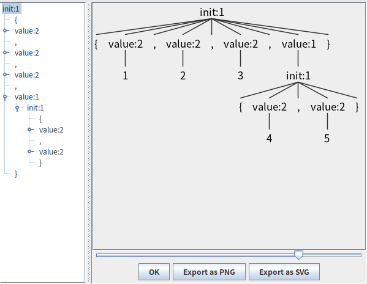
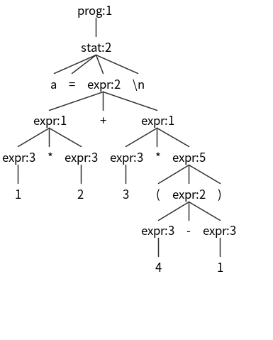

# [Antlr4](https://github.com/antlr/antlr4)

参考：

+ 《ANTLR4权威指南》（英文名：The Definitive ANTLR 4 Reference，也是源码主要贡献者编写的）

  要学会使用Antlr4首先需要理解其大概工作原理，这本书是最好的资料。

+ [ANTLR 4 Documentation](https://github.com/antlr/antlr4/blob/master/doc/index.md) （入门看看，作用不大，还是看书吧）

目标：

+ Antlr4 工作原理
+ 使用 Antlr4 改写 SQL
+ 如何实现自己的DSL
+ 如何实现从Java到Go的翻译器


## 基础知识

+ **语法解析器**（parser）/ **句法解析器（**syntax analyzer）

+ **词法分析**（lexical analysis，或称 词法符号化 tokenizing）

  将字符汇集为单词或符号（通称为**词法符号**，token）的过程；

  对应将输入文本转换为词法符号的程序称为词法分析器(lexer)。

  词法符号至少包含两部分信息：词法符号类型、词法符号的文本。


## 使用流程

同时也是ANTLR4的工作流程，参考 [Getting Started with ANTLR v4](https://github.com/antlr/antlr4/blob/master/doc/getting-started.md)。

Getting Started 提供了个加减乘除运算的简单例子，更多例子：[ANTLR reference book examples in Java](https://media.pragprog.com/titles/tpantlr2/code/tpantlr2-code.zip)。

### 定义语法规则

在 `.g4` 文件中使用 Antlr 元语言语法定义语法规则，元语言语法规则参考：[antlr4-g4.md](./antlr4-g4.md) 。

### 使用Antlr4工具根据语法规则生成解析器代码

```shell
# 安装 Antlr4 工具：默认安装 antlr4  antlr4-parse 到 ~/.local/bin
$ pip3 install antlr4-tools
# 如果需要下载并安装最新的ANLTR jar(4.13.1版本需要至少Java11)
$ antlr4
# antlr4-parse 可以按语法规则对表达式进行语法分析，用于校验g4文件语法规则
$ antlr4-parse ExprSimple.g4 prog -tree
# -tokens 展示词法分析获取的词法符号，参考《ANTLR4权威指南》C3.2
# 格式：@<第几个词法符号>,<此词法符号在语句中的开始索引>:<结束索引>='<词法符号的文本>'，<<词法类型>>，<位于输入语句第几行>:<此行第几个字符开始>
$ antlr4-parse ExprSimple.g4 prog -tokens -trace
$ antlr4-parse ExprSimple.g4 prog -gui
# 生成解析器代码：Expr.g4 是前面自定义语法规则的文件，默认生成java
# 实际使用时需要指定生成类的包路径: -package
# more options: https://github.com/antlr/antlr4/blob/master/doc/tool-options.md
$ antlr4 ExprSimple.g4 -package top.kwseeker.antlr4.examples.calc
$ antlr4 -Dlanguage=Cpp Expr.g4	# 生成C++解析器代码
# 生成的Java文件
.
├── ExprSimple.g4
# 默认情况下,ANTLR生成的语法分析器能将输入文本转换为一棵语法分析树。在遍历语法分析树时,遍历器能够触发一系列“事件”(回调),并通知我们提供的监听器对象。ArrayInitListener接口给出了这些回调方法的定义,我们可以实现它来完成自定义的功能。
├── ExprSimpleBaseListener.java
├── ExprSimpleListener.java
├── ExprSimple.interp
├── ExprSimpleLexer.interp
# 词法分析器，能够自动识别出我们的语法中的文法规则和词法规则。
├── ExprSimpleLexer.java 
# 这个文件包含了词法分析器生成的token的名称和对应的整数值的映射。
├── ExprSimpleLexer.tokens 
# 语法分析器，在该类中,每条规则都有对应的方法,除此之外,还有一些其他的辅助代码。用于构建语法树。
├── ExprSimpleParser.java
# ANTLR会给每个我们定义的词法符号指定一个数字形式的类型,然后将它们的对应关系存储于该文件中。
└── ExprSimple.tokens
```

### **在Java应用程序中集成Antlr4**

Maven依赖：

```xml
<!-- https://mvnrepository.com/artifact/org.antlr/antlr4-runtime -->
<dependency>
    <groupId>org.antlr</groupId>
    <artifactId>antlr4-runtime</artifactId>
    <version>4.13.1</version>
</dependency>
```

### 使用 Antlr4 接口实现自己的功能

Lexer 和 Parser 使用 .g4 文件中定义的语法规则将"语句"转换成 语法树对象，Antlr 使用内建的遍历器访问生成的语法分析树，并为每个遍历时可能处罚的事件生成一个语法分析树监听器接口。

#### 语法树生成编码

```java
ArrayInitLexer lexer = new ArrayInitLexer(input);
CommonTokenStream tokens = new CommonTokenStream(lexer);
ArrayInitParser parser = new ArrayInitParser(tokens);
//前面的只是通过流将 Lexer Parser 串联起来，init()表示执行init规则的语法分析
ParseTree tree = parser.init();	//ParseTree 即语法分析树
```

语法规则：

```antlr4
grammar ArrayInit;

/** A rule called init that matches comma-separated values between {...}. */
init  : '{' value (',' value)* '}' ;  // must match at least one value

/** A value can be either a nested array/struct or a simple integer (INT) */
value : init
      | INT
      ;

// parser rules start with lowercase letters, lexer rules with uppercase
INT :   [0-9]+ ;             // Define token INT as one or more digits
WS  :   [ \t\r\n]+ -> skip ; // Define whitespace rule, toss it out
```

比如输入： `{1,2,3,{4,5}}`

语法树结构：



语法树内存结构：（关注内部节点分层，词法符号类型，熟悉语法树的数据结构才能知道应该怎么遍历）

```properties
tree = {ArrayInitParser$InitContext@1137} "[]"
  children = {ArrayList@1237}  size = 9
    0 = {TerminalNodeImpl@1243} "{"
      symbol = {CommonToken@1238} "[@0,0:0='{',<1>,1:0]"
      parent = {ArrayInitParser$InitContext@1137} "[]"
    1 = {ArrayInitParser$ValueContext@1244} "[5]"
      children = {ArrayList@1265}  size = 1
        0 = {TerminalNodeImpl@1271} "1"
          symbol = {CommonToken@1266} "[@1,1:1='1',<4>,1:1]"
		  parent = {ArrayInitParser$ValueContext@1244} "[5]"
      start = {CommonToken@1266} "[@1,1:1='1',<4>,1:1]"
      stop = {CommonToken@1266} "[@1,1:1='1',<4>,1:1]"
      exception = null
      parent = {ArrayInitParser$InitContext@1137} "[]"
      invokingState = 5
    2 = {TerminalNodeImpl@1245} ","
      symbol = {CommonToken@1262} "[@2,2:2=',',<2>,1:2]"
      parent = {ArrayInitParser$InitContext@1137} "[]"
    3 = {ArrayInitParser$ValueContext@1246} "[7]"
      children = {ArrayList@1273}  size = 1
        0 = {TerminalNodeImpl@1278} "2"
      start = {CommonToken@1274} "[@3,3:3='2',<4>,1:3]"
      stop = {CommonToken@1274} "[@3,3:3='2',<4>,1:3]"
      exception = null
      parent = {ArrayInitParser$InitContext@1137} "[]"
      invokingState = 7
    4 = {TerminalNodeImpl@1247} ","
    5 = {ArrayInitParser$ValueContext@1248} "[7]"
      children = {ArrayList@1297}  size = 1
        0 = {TerminalNodeImpl@1302} "3"
      start = {CommonToken@1298} "[@5,5:5='3',<4>,1:5]"
      stop = {CommonToken@1298} "[@5,5:5='3',<4>,1:5]"
      exception = null
      parent = {ArrayInitParser$InitContext@1137} "[]"
      invokingState = 7
    6 = {TerminalNodeImpl@1249} ","
    7 = {ArrayInitParser$ValueContext@1250} "[7]"
      children = {ArrayList@1254}  size = 1
        0 = {ArrayInitParser$InitContext@1281} "[15 7]"
          children = {ArrayList@1283}  size = 5
            0 = {TerminalNodeImpl@1287} "{"
            1 = {ArrayInitParser$ValueContext@1288} "[5 15 7]"
              children = {ArrayList@1304}  size = 1
                0 = {TerminalNodeImpl@1309} "4"
              start = {CommonToken@1305} "[@8,8:8='4',<4>,1:8]"
              stop = {CommonToken@1305} "[@8,8:8='4',<4>,1:8]"
              exception = null
              parent = {ArrayInitParser$InitContext@1281} "[15 7]"
              invokingState = 5
            2 = {TerminalNodeImpl@1289} ","
            3 = {ArrayInitParser$ValueContext@1290} "[7 15 7]"
              children = {ArrayList@1311}  size = 1
                0 = {TerminalNodeImpl@1316} "5"
              start = {CommonToken@1312} "[@10,10:10='5',<4>,1:10]"
              stop = {CommonToken@1312} "[@10,10:10='5',<4>,1:10]"
              exception = null
              parent = {ArrayInitParser$InitContext@1281} "[15 7]"
              invokingState = 7
            4 = {TerminalNodeImpl@1291} "}"
          start = {CommonToken@1255} "[@7,7:7='{',<1>,1:7]"
          stop = {CommonToken@1256} "[@11,11:11='}',<3>,1:11]"
          exception = null
          parent = {ArrayInitParser$ValueContext@1250} "[7]"
          invokingState = 15
      start = {CommonToken@1255} "[@7,7:7='{',<1>,1:7]"
      stop = {CommonToken@1256} "[@11,11:11='}',<3>,1:11]"
      exception = null
      parent = {ArrayInitParser$InitContext@1137} "[]"
      invokingState = 7
    8 = {TerminalNodeImpl@1251} "}"
```

#### 词法符号结构

```plain
@<第几个词法符号>,<此词法符号在语句中的开始索引>:<结束索引>='<词法符号的文本>'，<<词法类型>>，<位于输入语句第几行>:<此行第几个字符开始>
```

词法符号的基础类`CommonToken`：

```java
protected int type;		//词法类型
protected int line;		//位于输入语句第几行
protected int charPositionInLine = -1;	//此行第几个字符开始
protected int channel = 0;
protected Pair<TokenSource, CharStream> source;
protected String text;	//词法符号的文本
protected int index = -1;	//第几个词法符号
protected int start;	//此词法符号在语句中的开始索引
protected int stop;		//此词法符号在语句中的结束索引
```

#### 语法分析树结构

+ 语法树有子节点的节点接口类 `RuleNode`，继承 `ParseTree`（代表所有节点）

  ```java
  interface ParseTree extends SyntaxTree
      interface SyntaxTree extends Tree
  ```

+ 语法树有子节点的节点，使用运行的规则名命名实现类并继承`ParserRuleContext`，比如上面 `InitContext` 是运行`init`规则分析获取的; `ValueContext` 对应`value`规则

  ```java
  //ParserRuleContex.java
  public class ParserRuleContext extends RuleContext {
      public static final ParserRuleContext EMPTY = new ParserRuleContext();
      public List<ParseTree> children; //子节点列表
      public Token start;	//指向children中第一个子节点
      public Token stop;	//指向children中最后一个子节点
      public RecognitionException exception;	//解析过程的异常
      ...
  }
  //RuleContext.java
  public class RuleContext implements RuleNode {
      public RuleContext parent;	//父节点
      public int invokingState = -1;	//与节点生成相关，只在节点生成时赋值，参考RuleContext构造器方法，todo
      ...
  }
  ```

+ 没有子节点的节点接口类`TerminalNode`，继承 `ParseTree`, 实现是 `TerminalNodeImpl`；

#### 语法树遍历

Antlr4 提供了两种遍历语法树的方式：监听器模式（实现 Listener 接口属于这种方式）、访问者模式（实现 Visitor 接口属于这种方式）。

##### 监听器模式

为了将遍历树时触发的事件转化为监听器的调用,ANTLR运行库提供了 ParseTree-Walker 类。

ParseTreeWalker调用序列：TODO 代码中调试调用序列。

只能按固定的顺序进行遍历。

##### 访问器模式

可以控制遍历语法分析树的过程。

在命令行中加入`-visitor`选项可以指示ANTLR为一个语法生成访问器接口(visitor interface)，语法中的每条规则对应接口中的一个visit方法。

**遍历规则**：

参考 Calc.java。



**实际遍历流程**：

Antlr4 默认提供了`AbstractParseTreeVisitor`实现默认的遍历规则是**深度优先遍历且会遍历每一个节点**，参考 `public T visitChildren(RuleNode node)`方法，里面可以通过 `protected T aggregateResult(T aggregate, T nextResult)` 方法聚合此层遍历结果；

自定义的 `ExprCalcEvalVisitor`其实是修改了遍历规则和聚合结果的行为，只关注需要用到的部分节点，比如处理 `expr ('*'|'/') expr ` 规则的 `MulDivContext` 会有3个子节点，中间的子节点仅用于判断算术类型不需要再遍历，两边的节点才是参与运算的节点才会继续深入遍历。

源码很容易理解。

```
a=1*2+3*(4-1)
^D
visitAssign called
visitAddSub called [16 6]
visitMulDiv called [4 16 6]
visitInt called [4 4 16 6]
visitInt called [33 4 16 6]
visitMulDiv called [36 16 6]
visitInt called [4 36 16 6]
visitParens called [33 36 16 6]
visitAddSub called [26 33 36 16 6]
visitInt called [4 26 33 36 16 6]
visitInt called [36 26 33 36 16 6]
a => 11
```


