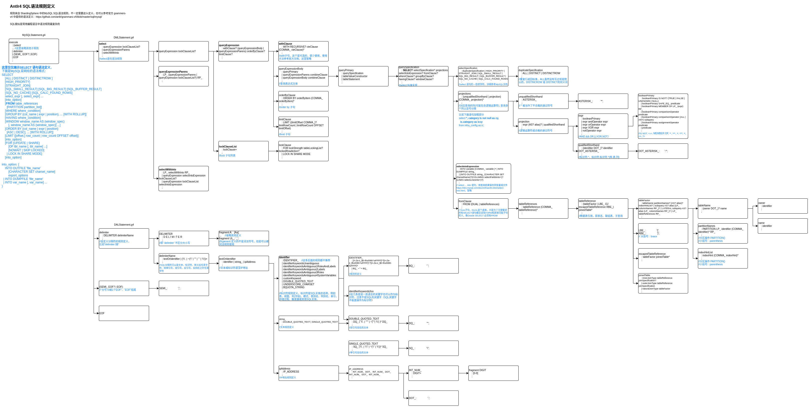

# Antlr4 解析 SQL 语句语法树

参考 `antlr4-mysql`模块实现，代码是从 ShardingSphere 抽离出来的并添加了注释说明，展示怎么使用 Antlr4 解析逻辑 SQL 并改写。

> 抽离的代码只展示了简单的SELECT语句的语法解析流程（一些不常用的语法都省略了），完整的SELECT语法解析步骤还是挺多的，但是理解起来也很简单，只是步骤很多。
>
> SQL 全部语法 Antlr4 规则定义就5K多行（对比 Java 不到3K行，Go不到1K行，Thrift IDL不到200行），完整的语法解析代码只会更多，但是从 ANTLR4 角度来看只是语法多，语法的解析流程都是一样的，所以没必要每个语法的解析流程都研究一遍。

其实官方源码模块分的已经很细了，解析SQL AST这部分代码和其他基本没什么耦合，且额外封装逻辑很少（仅仅是拓展了**SPI**和**本地缓存Caffeine**），可以直接读源码，根本没有理解阻力。

ShardingSphere 解析SQL AST 代码主要在ShardingSphere下面两个模块：

+ infra/parser

  核心接口类：SQLParserEngine。并

+ parser

  下面有两个子模块：

  + dialect

    定义各种方言sql的语法规则（Antlr4 .g4 文件），以及基本的词法分析器、语法解析器、Visitor的实现。

  + engine

    定义 Parser Visitor 引擎实现： SQLParserEngine SQLStatementVisitorEngine。


## Antlr4 SQL语法规则定义

代码中解析的规则是 `execute`：

```java
// MySQLParser
public ASTNode parse() {
	return new ParseASTNode(execute(), (CommonTokenStream) getTokenStream());
}
```

完整的SQL语法规则还是挺复杂的（5k多行），这里以select查询语句为例分析其语法规则定义:

参考 antlr4-sql-rule.drawio （并不完整）。




## 访问器方法改写

**每个 visit 方法对应一个 ANTLR4 文件中定义的规则**，改写访问逻辑时可以边调试，边改写访问逻辑。

比如改写 select 语句访问器方法，将 ANTLR4 解析树，转成更易读的 SQLStatement 语法树对象，即参照解析树结构从 visitSelect() 方法开始层层深入改写即可。


## MySQL SQL语法

参考：https://dev.mysql.com/doc/refman/8.0/en/sql-statements.html

上面的规则定义中出现了一些不常用的SQL语法，这里补充说明一下。

### TableReferencesContextDDL

### DML

+ [with](https://dev.mysql.com/doc/refman/8.0/en/with.html)

  使用`with`可以定义**公共表表达式**(CTE，common table expression)是一个命名的临时结果集，它存在于单个语句的作用域中，以后可以在该语句中多次引用它。

  格式：

  ```
  with_clause:
      WITH [RECURSIVE]
          cte_name [(col_name [, col_name] ...)] AS (subquery)
          [, cte_name [(col_name [, col_name] ...)] AS (subquery)] ...
  ```

  比如：

  ```sql
  WITH
    cte1 AS (SELECT a, b FROM table1),
    cte2 AS (SELECT c, d FROM table2)
  SELECT b, d FROM cte1 JOIN cte2
  WHERE cte1.a = cte2.c;
  # 递归公共表表达式是具有引用其自身名称的子查询的表达式。
  WITH RECURSIVE cte (n) AS
  (
    SELECT 1
    UNION ALL
    SELECT n + 1 FROM cte WHERE n < 5
  )
  SELECT * FROM cte;
  ```

### TL

